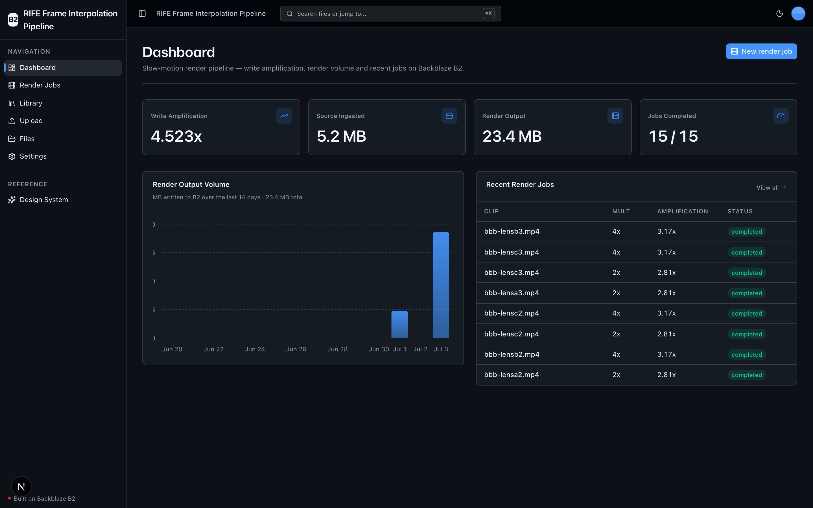
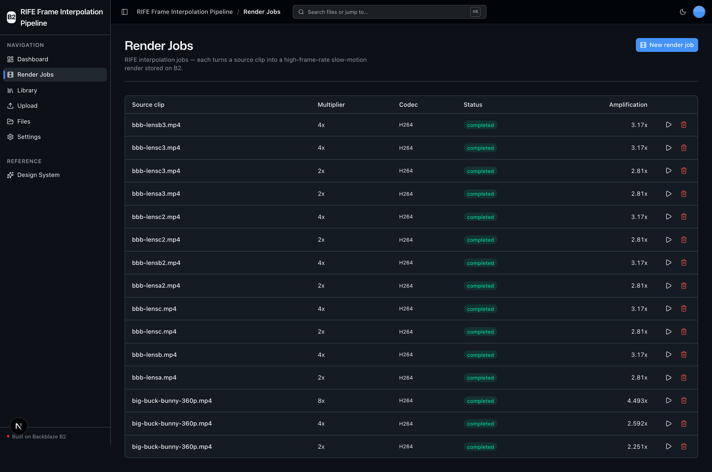
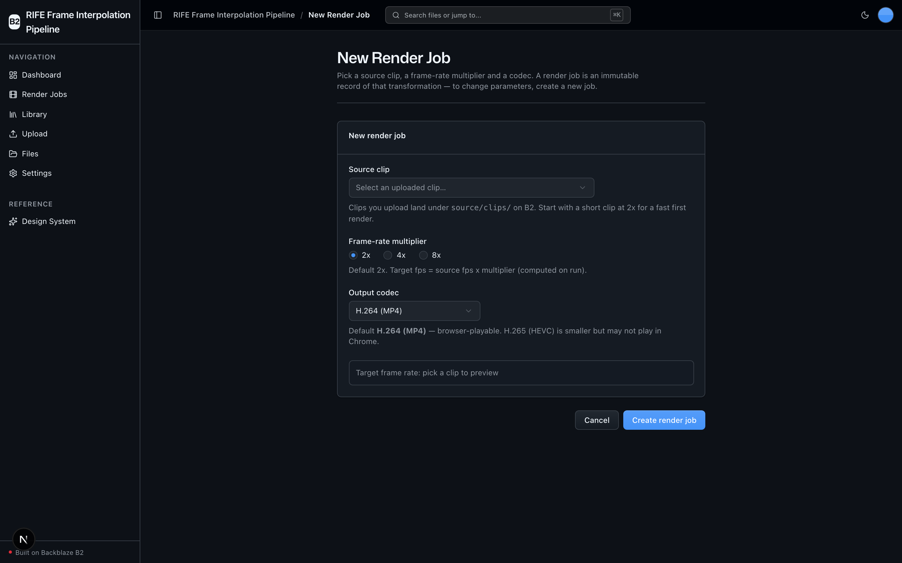
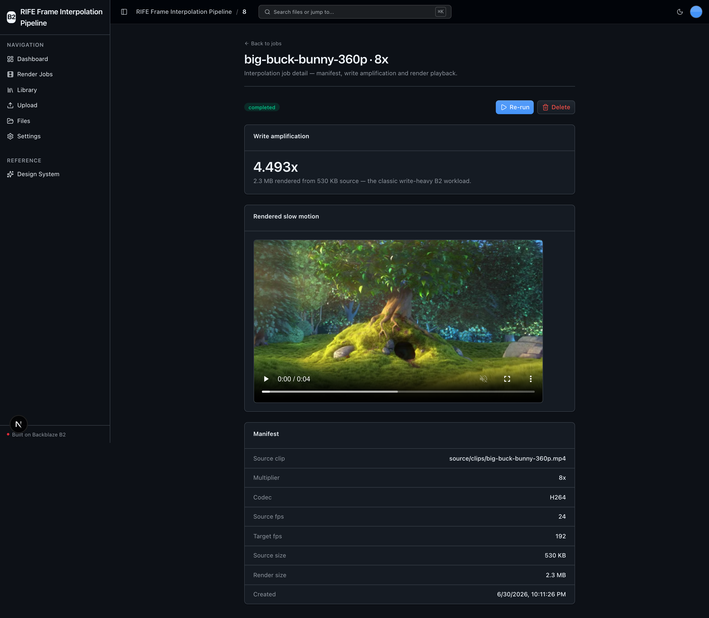
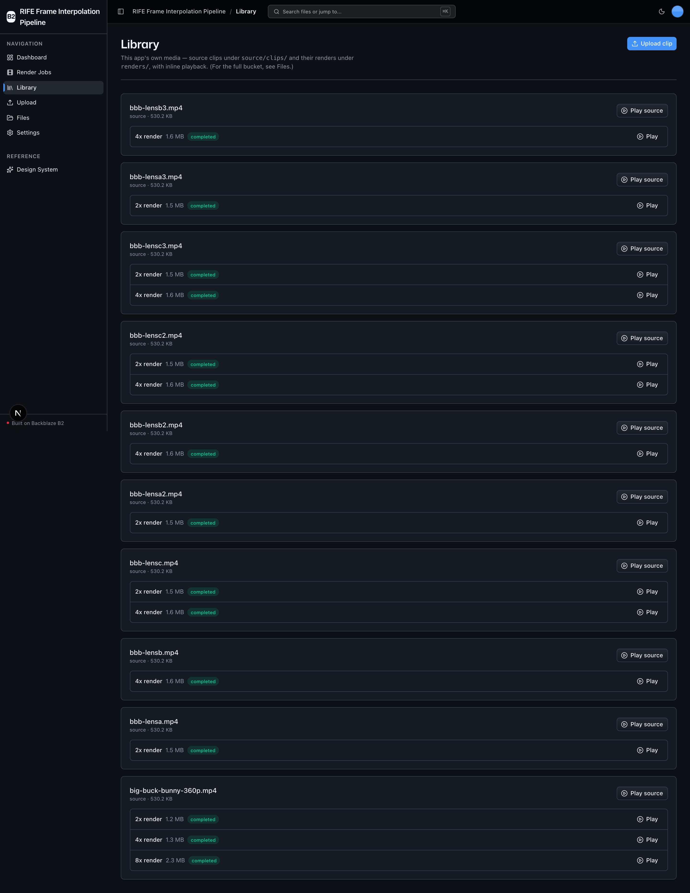
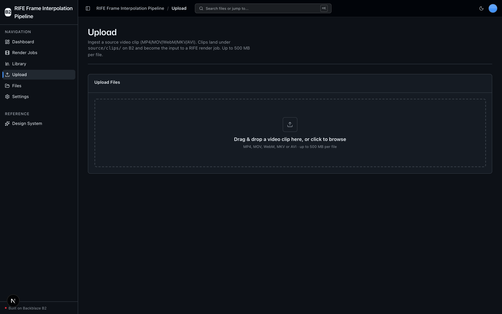

<!-- last_verified: 2026-06-30 -->
# RIFE Frame Interpolation Pipeline

Turn ordinary footage into buttery-smooth slow motion — self-hosted, with **B2 credentials only, no second API key**. This sample is a B2-backed video post-production pipeline: ingest source clips into **[Backblaze B2](https://www.backblaze.com/cloud-storage?utm_source=github&utm_medium=referral&utm_campaign=ai_artifacts&utm_content=b2ai-oss-start)**, run **Practical-RIFE** (optical-flow neural frame interpolation) on-device to synthesize intermediate frames, then play them back at the source frame rate so the clip runs 2x / 4x / 8x slower while staying smooth, and write the render back to B2.

It's for sports-analytics teams, cinematographers, and game studios who need self-hosted slow-mo without shipping frames to a paid API.

## What it looks like

**Dashboard** — write-amplification ratio, source-vs-render volume, a 14-day render-output chart, and recent render jobs.



**Render Jobs** — every interpolation job in one table: source clip, multiplier, codec, status, and its write-amplification ratio.



**New render job** — pick a source clip, a 2x / 4x / 8x frame-rate multiplier, and an output codec to define an immutable render.



**Job detail** — the rendered slow-motion clip playing inline, its write-amplification headline, and the full B2 manifest.



**Library** — this app's own media: each source clip with its 2x / 4x / 8x renders and inline playback.



**Upload** — drag-and-drop video ingest into `source/clips/` on B2, the input to every render job.



## Why B2: the write-amplification story

Frame interpolation is a **write-heavy** workload. A 4x interpolation of a 1 TB source library produces **4+ TB of render output**, and continuous batch jobs sustain high write throughput. The dashboard surfaces the ratio (**render bytes ÷ source bytes**) front and center — the classic write-heavy workload B2 is ideal and cost-effective for.

## The 5-step pipeline

1. **Ingest** — upload a source clip; it lands under `source/clips/` on B2 over the S3 API.
2. **Interpolate** — RIFE synthesizes `multiplier - 1` intermediate frames between every adjacent pair, on-device (CPU by default; CUDA / Apple MPS auto-detected).
3. **Encode** — the interpolated frames are re-encoded to a browser-playable MP4 (H.264 default) at the **source fps**, so the `multiplier`× extra frames stretch the clip to `multiplier`× its duration (`1/multiplier` speed) — genuine slow motion, not just a smoother same-length clip.
4. **Store** — the render is uploaded back to B2 (multipart) under `renders/<clip_id>/<multiplier>x/`, alongside a JSON manifest.
5. **Serve** — the render streams into an HTML5 `<video>` player via a short-lived presigned URL.

## Quickstart

**Prerequisites:** Node ≥ 20, pnpm ≥ 9, **Python ≤ 3.11** (a RIFE constraint — newer Python trips torch/RIFE wheel gaps). ffmpeg is **bundled** via `imageio-ffmpeg` — no system install needed.

```bash
# 1. Configure B2 (S3-compatible)
cp .env.example .env
#    edit .env: B2_APPLICATION_KEY_ID, B2_APPLICATION_KEY, B2_BUCKET_NAME, B2_REGION

# 2. Backend venv (use Python 3.11)
cd services/api
python3.11 -m venv .venv && source .venv/bin/activate
pip install -r requirements.txt          # base — API boots + tests pass without ML
pip install -r requirements-ml.txt       # heavy ML stack (torch, OpenCV, ffmpeg)
python scripts/setup_rife.py             # fetch the pinned RIFE weights (one time)
cd ../..

# 3. Frontend + run everything
pnpm install
pnpm dev                                 # doctor preflight, then Next + FastAPI

# 4. (optional) seed a synthetic demo clip so you have something to interpolate
pnpm seed:demo
```

Then open the app, go to **Upload** (or run `pnpm seed:demo`), then **Render Jobs → New render job**, pick the clip + a multiplier + a codec, **Run**, and watch the slow-mo render play back.

### The RIFE model (reproducible, no manual downloads)

`scripts/setup_rife.py` (`pnpm setup:rife`) fetches `flownet.pkl` from a **pinned HuggingFace mirror revision** into `services/api/models/rife/` (gitignored). Upstream Practical-RIFE distributes weights only via Google Drive / Baidu, which can't be scripted — the pinned mirror makes setup deterministic. The model **architecture** is vendored under `services/api/app/repo/rife_vendor/` (MIT; credit **hzwer / Practical-RIFE**). Repo / file / revision are all env-configurable (`RIFE_WEIGHTS_HF_REPO`, `RIFE_WEIGHTS_HF_FILE`, `RIFE_WEIGHTS_HF_REVISION`, `RIFE_MODEL_DIR`).

The app **boots and every B2/UI flow works without the model present** — a job run just fails with an actionable "run scripts/setup_rife.py" message until you fetch the weights.

### Device selection

Interpolation is on-device and defaults to **CPU**. The engine auto-detects **CUDA → Apple MPS → CPU** at runtime and never hard-requires a GPU. `MAX_SOURCE_FRAMES` caps a CPU demo so a first render finishes fast; raise it for a full clip.

### Codec note

The default render codec is **H.264 (libx264) in MP4** with `yuv420p` + `+faststart` so renders reliably paint in the `<video>` element. H.265/HEVC is offered as an opt-in codec but may not play in Chrome — H.264 is the safe default (a deliberate deviation from a strict "HEVC" reading, justified by browser playability).

## What's in the box

- **Render Jobs** (`/jobs`) — create / read / run / delete interpolation jobs, with live progress.
- **Library** (`/library`) — this app's own media: source clips + their renders, with inline playback (scoped to `source/clips/` and `renders/`).
- **Files** (`/files`) — full-bucket explorer (kept from the starter kit).
- **Upload** (`/upload`) — drag-and-drop clip ingest into `source/clips/`.
- **Dashboard** (`/`) — write-amplification ratio, render-output volume, recent jobs.
- FastAPI backend with strict layered architecture + structural tests; Next.js 16 + shadcn/ui frontend.

## B2 integration

All access is via the **S3-compatible API** (boto3), never the b2-native API. The S3 client sets a custom user agent (`b2ai-rife-frame-interpolation-pipeline`) and derives its endpoint from `B2_REGION` (no hardcoded region in source). Renders upload via boto3's managed multipart transfer. See [ARCHITECTURE.md](ARCHITECTURE.md).

Need a bucket? **[Create a free Backblaze B2 account](https://www.backblaze.com/sign-up/ai-cloud-storage?utm_source=github&utm_medium=referral&utm_campaign=ai_artifacts&utm_content=b2ai-oss-start)** and generate an application key.

## Docs

| Topic | Location |
|-------|----------|
| Coding-agent control surface | [AGENTS.md](AGENTS.md) |
| System layout, data flows | [ARCHITECTURE.md](ARCHITECTURE.md) |
| Feature docs | [docs/features/](docs/features/) |
| User journeys | [docs/app-workflows.md](docs/app-workflows.md) |
| Dev + testing workflows | [docs/dev-workflows.md](docs/dev-workflows.md) |
| Security / Reliability | [docs/SECURITY.md](docs/SECURITY.md) · [docs/RELIABILITY.md](docs/RELIABILITY.md) |

## Credits

Frame interpolation uses the **[Practical-RIFE](https://github.com/hzwer/Practical-RIFE)** model by hzwer (Zhewei Huang) et al. (ECCV 2022), MIT-licensed. Only the model architecture is vendored; weights are fetched from a pinned mirror. See `services/api/app/repo/rife_vendor/NOTICE`.
